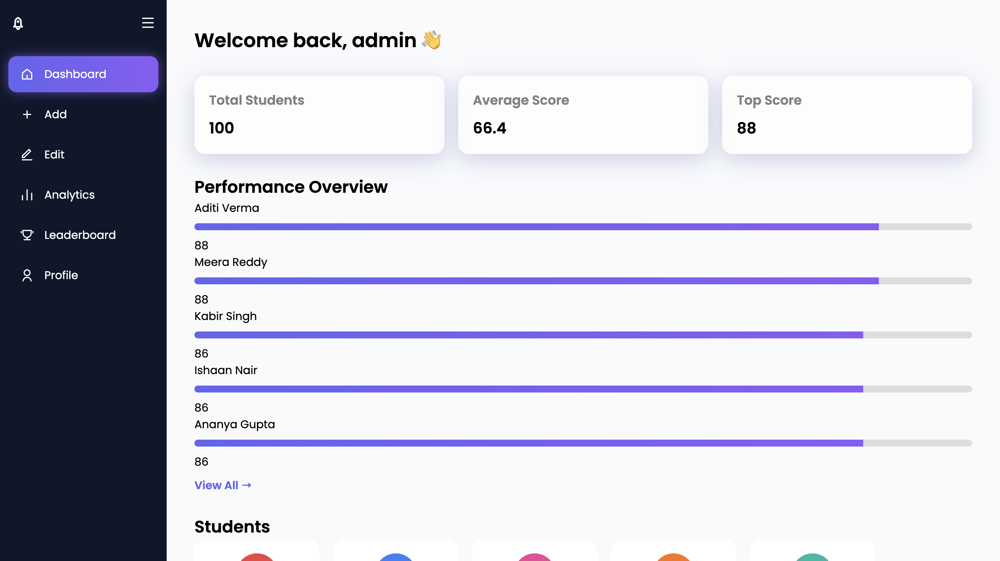
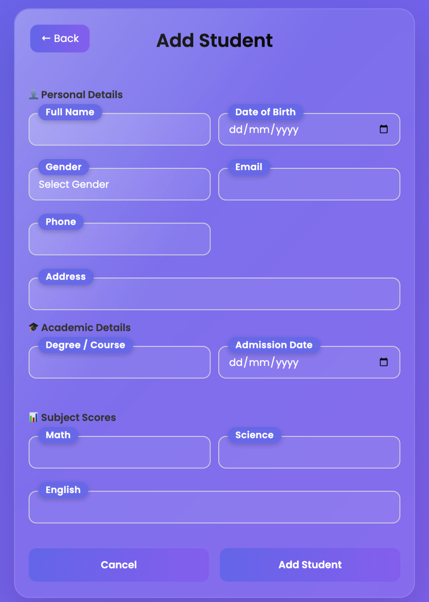
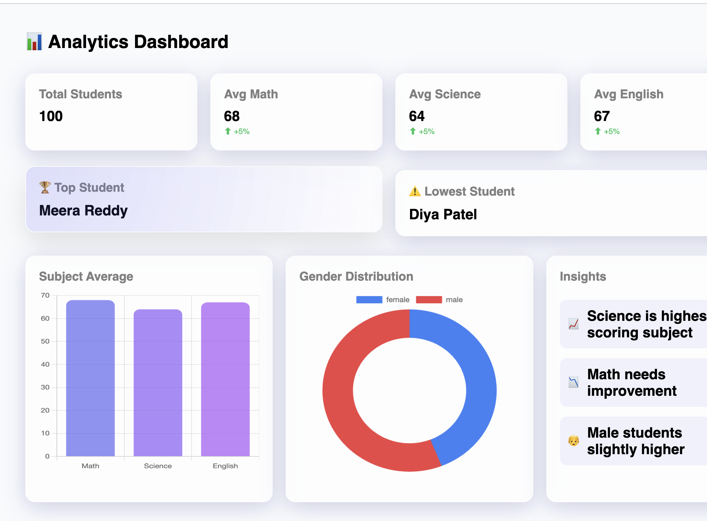

# 🎓 Student Management System

<p align="center">
  
  
  
  
</p>

<p align="center">
  🚀 A modern dashboard to manage students, track performance, and visualize analytics.
</p>

---

## ✨ Features

- 📊 Interactive Dashboard  
- ➕ Add / Edit Students  
- 🏆 Leaderboard Ranking  
- 📈 Analytics with Charts  
- 👤 Profile Management  
- 🌙 Dark Mode  
- 🎨 Smooth UI Animations  

---

## 🖼️ Preview

### 🏠 Dashboard


### ➕ Add Student


### 📊 Analytics


---

## 🛠️ Tech Stack

- ⚙️ Flask (Python)  
- 🗄️ SQLite  
- 🎨 HTML, CSS, JavaScript  

---

## ⚙️ Setup

git clone https://github.com/SwaggiAz/student-management-system.git  
cd student-management-system  
pip install flask  
python app.py  

---

## 🔐 Default Login

**Username:** admin  
**Password:** admin  

---

## 📂 Project Structure

```
student-management-system/
├── static/
│   ├── style.css
│   ├── script.js
│   └── images/

├── templates/
│   ├── dashboard.html
│   ├── add.html
│   ├── edit.html
│   └── analytics.html

├── app.py
├── database.db
└── README.md
```

---

## 🚀 Future Improvements

- 🔐 Role-based authentication  
- 📤 Export data (CSV / PDF)  
- ☁️ PostgreSQL integration  
- 🔗 API support  
- 📱 Mobile responsiveness  

---

## 👨‍💻 Author

**Aniket Zaveri**

---

## ⭐ Support

If you like this project, give it a ⭐ on GitHub!
